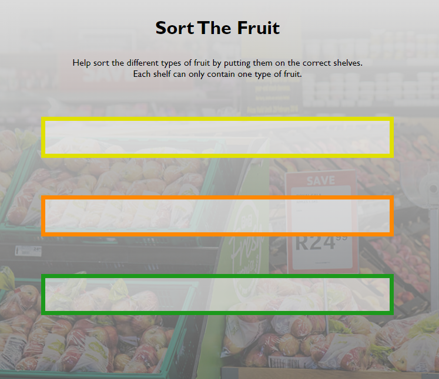
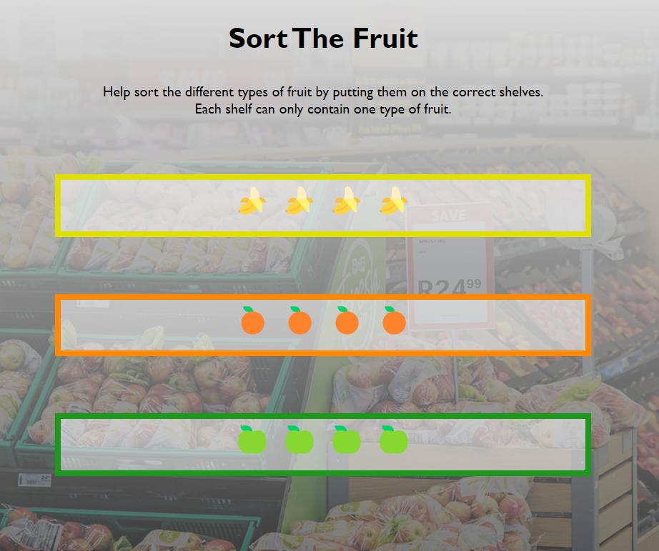

# Sort the Fruit

A simple exercise to teach JavaSpcript loops and DOM interaction

## Before you start coding

First you need to either **[clone](https://docs.github.com/en/repositories/creating-and-managing-repositories/cloning-a-repository)** this repository, to work on the code in your local environment. Or you can **[fork](https://docs.github.com/en/get-started/quickstart/fork-a-repo)** it to your own GitHub account and then open it in a cloud-based code editor (or even clone it from there).

Open a preview of the site. Depending on which IDE you're using this might differ. But the Live Server extension for VS Code is an easy tool to use for this.

The preview should look like this: 

On this page you can see three empty shelves in a supermarket.
They now need filling!

## The Challenge

If you take a look inside the [script.js](assets/js/script.js) file, you will find an array of unsorted fruit.

Your job is it to sort the fruit in the array by type and place them all on their respective shelves.

You only need to add code in the script file to achieve this. There is no need to alter any HTML or CSS in this challenge.

Good Luck!

## The Solution

This is what your page should look like after you've written the correct JavaScript code:

## Hints

    

        Hint 1
    

    
  
        Are you sure you want a hint?
        

            

                Yes! I'm sure.
            

            

                Take a look in the index.html document.  Which DOM elements do you need to access and how can you achieve this?  What characteristic of those DOM elements would you utilise for this?
            

        

    

    

        Hint 2
    

    
  
        Are you sure you want another hint?
        

            

                Yes! I'm sure.
            

            

                The fruit is stored in an array.  What kind of data is this?  
                Think about how you can iterate over the array and access its items.
            

        

    

    

        Hint 3
    

    
  
        Are you sure you want a hint?
        

            

                Yes! I'm sure.
            

            

                What is the next step after accessing every single item in the array?  
                What kind of conditions are you looking for in a specific item and what kind of syntax do you need to use for this logic?
            

        

    

    

        Hint 4
    

    
  
        Are you sure you want a hint?
        

            

                Yes! I'm sure.
            

            

                Once you have sorted the array's items by their type, how can you get them to display on the page on their shelves?  
                Is there a way you could add them to a variable that refers to the relevant DOM element? Possible one that you've created earlier?
            

        

    

## Credits

*bg-supermarket.jpg*: https://virtualbackgrounds.site/background/produce-department-in-a-supermarket/